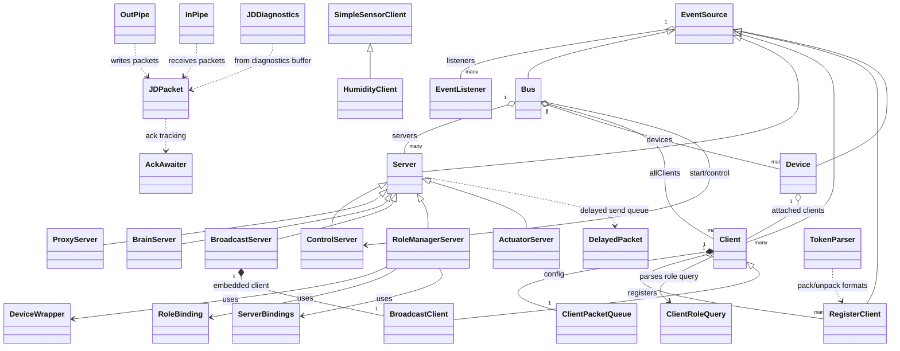

# Jacdac Top-Level TypeScript Design

This document summarizes Jacdac classes and relationships found in top-level `*.ts` files in this repository root.

## Scope

Included files are root-level TypeScript files such as:
`eventsource.ts`, `packet.ts`, `eventqueue.ts`, `pipes.ts`, `routing.ts`, `rolemgr.ts`, `service.ts`, `servers.ts`, `diagnostics.ts`, `pack.ts`, and `test.ts`.

## Design Summary

The architecture is centered around three layers:

1. Event foundation (`EventSource` and listeners)
2. Packet and transport primitives (`JDPacket`, pipe classes, pack/unpack)
3. Routing and binding (`Bus`, `Device`, `Server`, `Client`, role manager)

`EventSource` is the base type for most runtime objects. `Bus` orchestrates startup, device discovery, packet dispatch, and client/server attachment. `Device` represents a remote Jacdac node and routes incoming packets to matching clients. `Server` and `Client` implement service behavior, with `RegisterClient` handling typed register state and sync.

`RoleManagerServer` performs role-to-device/service binding using helper structures (`RoleBinding`, `ServerBindings`, `DeviceWrapper`).

## Class Inventory (Top-Level `*.ts`)

### Event Foundation
- `EventListener` (`eventsource.ts`)
- `EventSource` (`eventsource.ts`)

### Packet/Transport
- `JDPacket` (`packet.ts`)
- `AckAwaiter` (`packet.ts`, internal)
- `DelayedPacket` (`eventqueue.ts`, internal)
- `InPipe` (`pipes.ts`)
- `OutPipe` (`pipes.ts`)
- `TokenParser` (`pack.ts`, internal)
- `JDDiagnostics` (`diagnostics.ts`)

### Core Routing
- `Bus` extends `EventSource` (`routing.ts`)
- `Server` extends `EventSource` (`routing.ts`)
- `Client` extends `EventSource` (`routing.ts`)
- `RegisterClient<T>` extends `EventSource` (`routing.ts`)
- `Device` extends `EventSource` (`routing.ts`)
- `ClientRoleQuery` (`routing.ts`)
- `ClientPacketQueue` (`routing.ts`, internal)
- `RegQuery` (`routing.ts`, internal)
- `ProxyServer` extends `Server` (`routing.ts`, internal)
- `BrainServer` extends `Server` (`routing.ts`, internal)
- `ControlServer` extends `Server` (`routing.ts`)

### Role Management
- `RoleManagerServer` extends `Server` (`rolemgr.ts`)
- `DeviceWrapper` (`rolemgr.ts`, internal)
- `RoleBinding` (`rolemgr.ts`, internal)
- `ServerBindings` (`rolemgr.ts`, internal)

### Service Helpers
- `BroadcastClient` extends `Client` (`service.ts`)
- `BroadcastServer` extends `Server` (`service.ts`)
- `ActuatorServer` extends `jacdac.Server` (`servers.ts`, internal)
- `HumidityClient` extends `jacdac.SimpleSensorClient` (`test.ts`, test/example)

## Relationship Notes

- Inheritance spine:
  - `EventSource` -> `Bus`, `Server`, `Client`, `RegisterClient`, `Device`
  - `Server` -> `ControlServer`, `RoleManagerServer`, `BroadcastServer`, `ProxyServer`, `BrainServer`, `ActuatorServer`
  - `Client` -> `BroadcastClient`
- Composition highlights:
  - `Bus` owns `Server[]`, `Device[]`, and tracks `Client[]`
  - `Device` owns attached `Client[]` and packet query state
  - `Client` owns a `ClientPacketQueue` and `RegisterClient[]`
  - `RoleManagerServer` computes role bindings via `DeviceWrapper`, `RoleBinding`, and `ServerBindings`
- Packet flow:
  - `JDPacket` send path loops back through `bus.processPacket(...)`
  - `Server.sendEvent(...)` uses delayed retransmission (`delayedSend`)
  - Pipes (`InPipe`/`OutPipe`) exchange framed data via `JDPacket` on `JD_SERVICE_INDEX_PIPE`

## Mermaid Diagram



  ## Runtime Packet Flow Diagram

  ```mermaid
  flowchart TD
    App[Application code] -->|start and announce| Bus[Bus]

    subgraph LocalDevice
      direction TD
      Bus --> Servers[Server instances]
      Bus --> Clients[Client instances]
      Servers -->|send report event| Pkt[JDPacket]
      Clients -->|send command set reg| Pkt
      Servers -.->|sendEvent retries| DelayQ[DelayedPacket queue]
      DelayQ --> Pkt
    end

    Pkt -->|send core| Phys[Jacdac physical transport]
    Phys -->|incoming frame| PktIn[JDPacket from binary]
    PktIn -->|processPacket| Bus

    Bus -->|route by device id and service index| Dev[Device]
    Dev -->|dispatch packet| MatchClient[Bound Client]
    MatchClient -->|update register cache| Regs[RegisterClient values]

    Dev -->|GET register query| RegQuery[RegQuery cache]
    RegQuery --> Dev

    subgraph PipeChannel
      direction TD
      InPipe[InPipe] -->|pipe packets| Pkt
      Pkt -->|pipe packets| OutPipe[OutPipe]
      OutPipe -->|ack retries| Ack[AckAwaiter]
    end

    RoleMgr[RoleManagerServer] -->|bind and unbind roles| Bus
    RoleMgr --> BindHelpers[RoleBinding and ServerBindings and DeviceWrapper]
  ```
